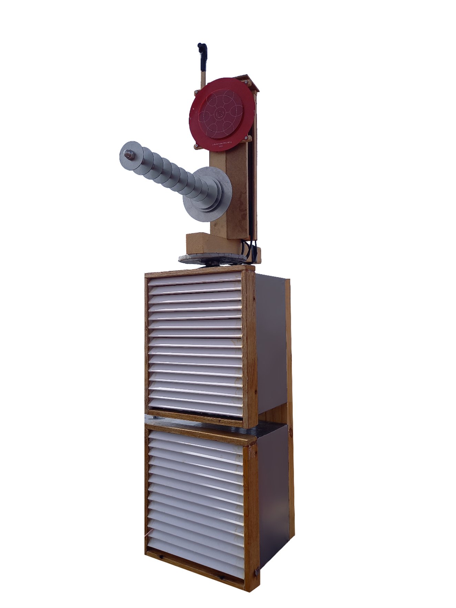
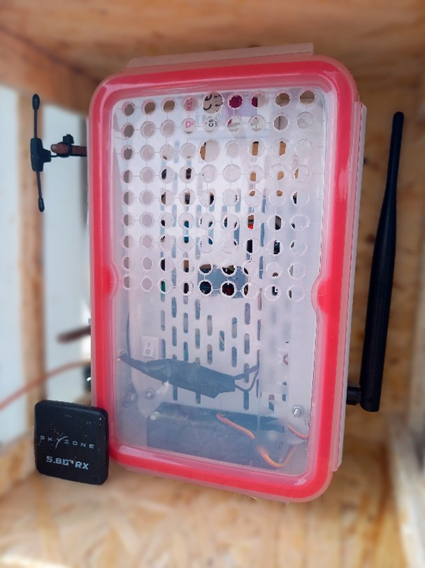
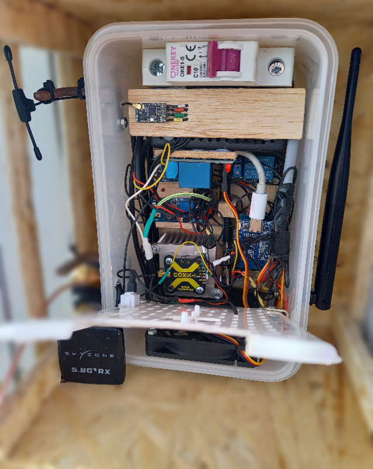
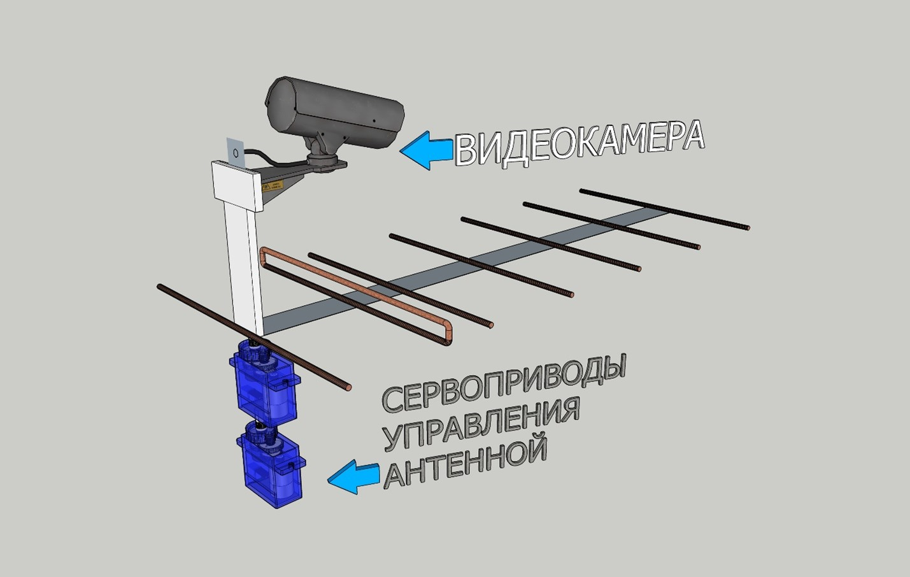
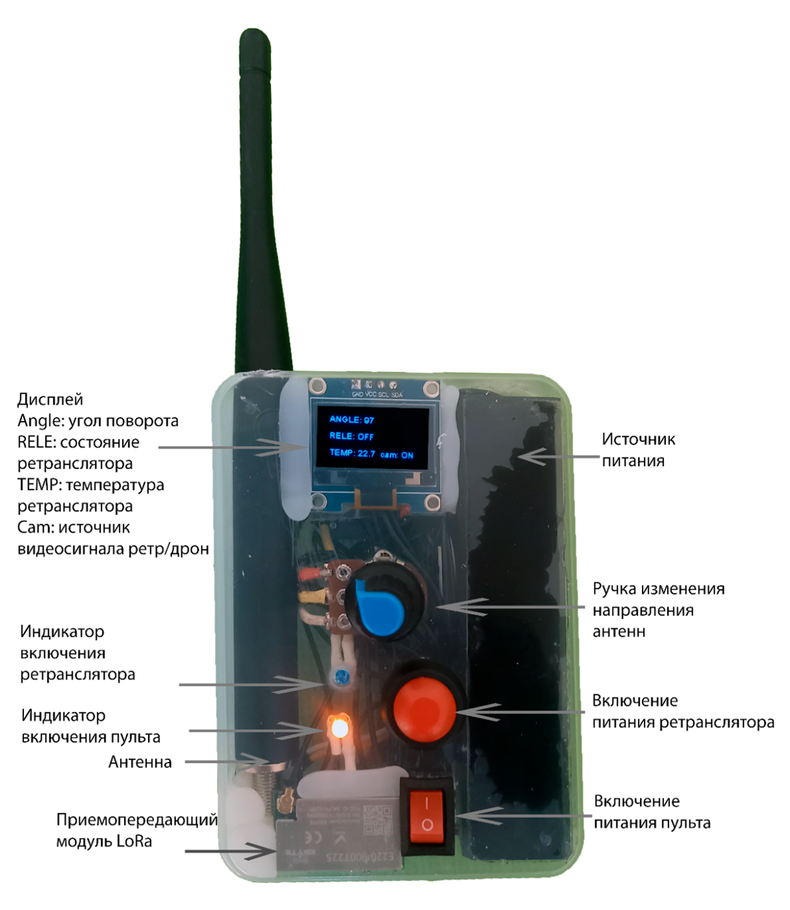
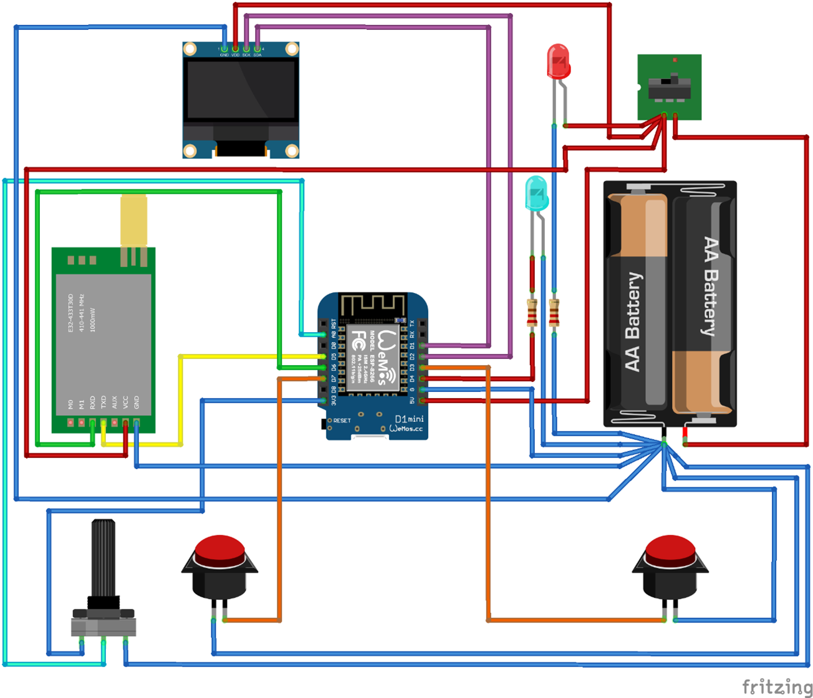

# Ретранслятор для FPV с дистанционным управлением

📡 Система удалённого управления ретранслятором для FPV-дронов и других беспроводных устройств.  
Основана на **LoRa (E220-900T22S)** и **ESP8266 (Wemos D1 Mini)**.  
Предназначена для **дальнобойной связи**.


<p align="center">
  <a href="docs/photos/front_view_comments.jpg">
    
  </a>
</p>


---

## ✨ Возможности
- Дальнобойная связь по LoRa (до 8–15 км в зависимости от антенн).
- Управление дроном и ретранслятором одним человеком. 
- Дистанционное управление питанием узлов ретранслятора.  
- Поворотная платформа для антенн с углом вращения 360° (возможно оригинальное решение на двух сервоприводах).  
- Контроль температуры и автоматическое управление вентилятором.  
- Переключение видеосигнала (с дрона или с камеры ретранслятора).  
- OLED-дисплей на пульте управления с отображением текущего состояния.  
- Энергоэффективные режимы сна для длительного автономного использования.  

---

## 📂 Структура репозитория
```lora-dx/
├── README.md                # Основное описание проекта
├── docs/                    # Подробные описания, схемы
│   ├── description.pdf
│   └── photos/
│
├── hardware/                # Аппаратная часть
│   ├── schematics/          # Схемы подключения (из текста + изображения)
│   │   └── text-scheme-controller.md # Текстовая схема подключения блока управления
│   │   └── text-scheme-remote.md # Текстовая схема подключения пульта управления
│   └── wiring-diagrams.png/           # Схема пульта управления
│
├── firmware/                # Код для контроллеров
│   ├── controller/          
│   │   └── controller.ino   # Блок управления ретранслятором
│   ├── remote/              
│   │   └── remote.ino       # Пульт управления
│
│
└── .gitignore
```
---


## 🛠️ Архитектура устройства

| Компонент | Фото (кликабельно) |
|-----------|------|
| **Ретранслятор** — передача управляющих сигналов и видео |  |
| **Блок управления** — контроллер на ESP8266 + LoRa |   |
| **Поворотная платформа** — управляемые сервоприводы + камера |  |
| **Пульт оператора** — с дисплеем и управлением режимами |  |
| **БПЛА** — FPV борт со своей камерой |  |


## 🔌Схема пульта управления
<p align="center">
  <a href="hardware/wiring-diagrams.png">
    
  </a>
</p>


## 💻 Программное обеспечение

Код прошивок находится в папке [firmware/](firmware/):

- [controller/controller.ino](firmware/controller/controller.ino) — прошивка для блока управления ретранслятором.
- [remote/remote.ino](firmware/remote/remote.ino) — прошивка для пульта оператора.

  
## 🔧 Используемые компоненты
- **LoRa E220-900T22S** (модуль связи)  
- **ESP8266 Wemos Mini** (контроллер)  
- **Сервоприводы TD-8320MG**  
- **OLED дисплей SSD1306 (0.96")**  
- **DS18B20** (датчик температуры)  
- **Реле**  

## 📑 Документация
Подробное описание  — в [docs/description.pdf](docs/description.pdf).

## ⚖️ Лицензия
Проект распространяется под лицензией [MIT](LICENSE).

