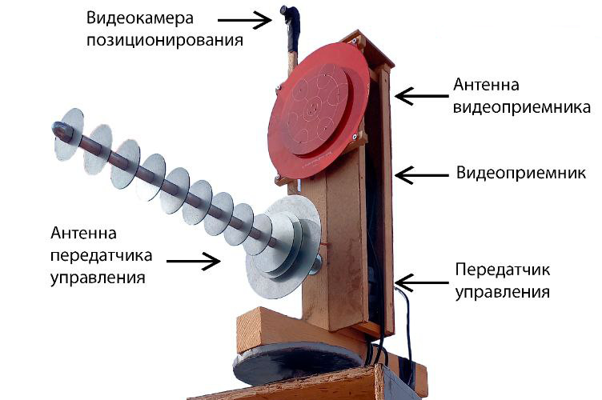

# Ретранслятор для FPV с дистанционным управлением на LORA

📡 Система **дальнобойного** удалённого управления ретранслятором для FPV-дронов и других беспроводных устройств. Насыщен фичами вроде поворотного устройства с направленнвси антенами, переключения картики с камеры на поворотке на камеру бпла, температурными датчики, управления системой охлаждения, отображения на пульте дисплея параметров таких как угол поворота и тд.  
Основано на **LoRa (E220-900T22S)** и **ESP8266 (Wemos D1 Mini)**.  


<p align="center">
  <a href="docs/photos/front_view_comments.jpg">
    
  </a>
</p>


---

## ✨ Возможности
- Дальнобойная связь по LoRa (до 8–15 км в зависимости от антенн).
- Управление дроном и ретранслятором одним человеком. 
- Дистанционное управление питанием узлов ретранслятора.  
- Поворотная платформа для антенн с углом вращения 360° (возможно оригинальное решение на двух сервоприводах).  
- Контроль температуры и автоматическое управление вентилятором.  
- Переключение видеосигнала (с дрона или с камеры ретранслятора).  
- OLED-дисплей на пульте управления с отображением текущего состояния.  
- Энергоэффективные режимы сна для длительного автономного использования.  

---

## 📂 Структура репозитория
```lora-dx/
├── README.md                # Основное описание проекта
├── docs/                    # Подробные описания, схемы
│   ├── description.pdf
│   └── photos/
│
├── hardware/                # Аппаратная часть
│   ├── schematics/          # Схемы подключения (из текста + изображения)
│   │   └── text-scheme-controller.md # Текстовая схема подключения блока управления
│   │   └── text-scheme-remote.md # Текстовая схема подключения пульта управления
│   └── wiring-diagrams.png/           # Схема пульта управления
│
├── firmware/                # Код для контроллеров
│   ├── controller/          
│   │   └── controller.ino   # Блок управления ретранслятором
│   ├── remote/              
│   │   └── remote.ino       # Пульт управления
├── LICENSE                  # Лицензия 
│
└── .gitignore
```
---


## 🛠️ Архитектура устройства

| Компонент | Фото (кликабельно) |
|-----------|------|
| **Ретранслятор** — Все устройство в сборе. Конструкцию делал просторную для удобства ревизии и настройки, так что поместил все в короба из OSB, сделал вентилируемый фасад. Плюс это дополнительная защита от осадков, солнца, птичьх гнезд и тд. <br> Нижнний это короб блок управления и ретранслятор. В верхнем коробе собрана поворотка, сверху антны. Под управление elrs использовал 11-ти элементную пушку на 2,4 ГГц, под видео патч на 5,8 ГГц. Передающие и приемные части постарался максимально разнести, поэтому видеоприемник поместил в маленьком коробе сразу за антеной. Также поближе к антене подтащил передатчик  управления  elrs на 2,4 ГГц, в качестве которого использовал внешний модуль для пульта Jumper |  |
| **Блок управления** — контроллер на ESP8266 + LoRa. Здесь же собрана основная электроника от ретранслятора. Все это помещено в пластиковый пищевой контейнер для защиты  от осадков. <br> В коробке поместилось:  <br> - Трансивер lora на микросхеме E220-900T22S, антена от него справа выходит.  <br> - Видеопередатчик SpeedyBee TX800, который скидывает видеосигнал к оператору, виден внизу на фото, сидит на радиаторе, на выход подключена аннтена skyzone, слава сбоку выходит. <br> - Приемник elrs, на фото сверху, аннтена диполь слева сверху  выходит. <br> - Внизу вентилятор охлаждения, включается по заданной температуре, тамже датчик температуры DS18B20. <br> - Сверху автомат 10А 220В, так так ретранслятор у меня стационарный и есть возможность тада 220 вольт завести. Под ним блок питания, на выходе которого 12в, и ниже вторичный стабилизатор на 5В для ESP8266 Wemos Mini. <br> - Текже поместилось пару типовых реле от Ардуино. Одно которое по команде подает питание на ретраслятор, другое по температуре включает вентилятор.    |   |
| **Поворотная платформа** — управляемые сервоприводы + камера |    |
| **Пульт оператора** — с дисплеем и управлением режимами |  |
| **БПЛА** — FPV борт со своей камерой |  |


## 🔌Схема 
<p align="center">
  <a href="hardware/wiring-diagrams.png">
    
  </a>
</p>

- Текстовая схема подключения блока управления  — в [hardware/schematics/text-scheme-controller.md](hardware/schematics/text-scheme-controller.md).
- Текстовая схема подключения пульта управления  — в [hardware/schematics/text-scheme-remote.md](hardware/schematics/text-scheme-remote.md).

## 💻 Программное обеспечение

Код прошивок находится в папке [firmware/](firmware/):

- [controller/controller.ino](firmware/controller/controller.ino) — прошивка для блока управления ретранслятором.
- [remote/remote.ino](firmware/remote/remote.ino) — прошивка для пульта оператора.

  
## 🔧 Используемые компоненты
- **LoRa E220-900T22S** (модуль связи)  
- **ESP8266 Wemos Mini** (контроллер)  
- **Сервоприводы TD-8320MG**  
- **OLED дисплей SSD1306 (0.96")**  
- **DS18B20** (датчик температуры)  
- **Реле**  

## 📑 Документация
Подробное описание  — в [docs/description.pdf](docs/description.pdf).

## ⚖️ Лицензия
Проект распространяется под лицензией [MIT](LICENSE).

